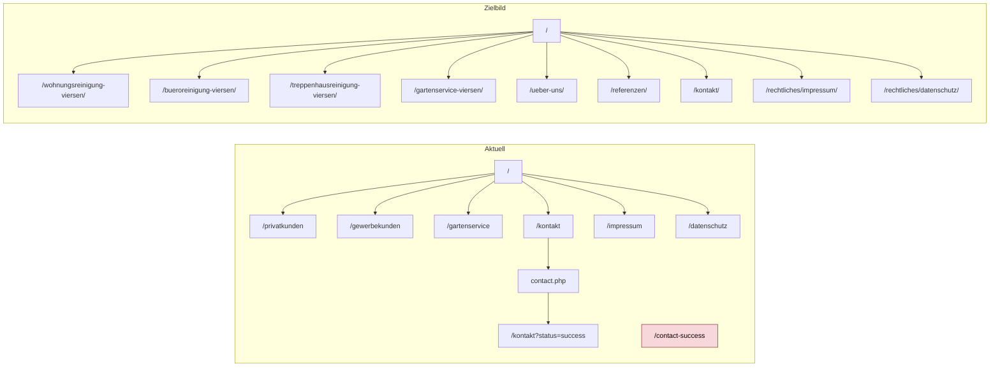

# Webdesign- und SEO-Refactoring-Audit für

## Kontext und Prüfrahmen

Diese Prüfung ist ein hybrider Audit aus Quellcode-Inspektion des bereitgestellten ZIP-Archivs, aktueller SERP-Stichprobe und Best-Practice-Abgleich. Die Live-Umgebung der vermuteten Produktionsdomain ließ sich extern nicht belastbar abrufen; deshalb sind alle serverseitigen Befunde zu HTTPS, Headern, Redirect-Ketten, Caching, robots.txt, sitemap.xml und Statuscodes als **im Paket nicht nachweisbar** zu lesen, nicht als endgültig „live bestätigt“. Zielmarkt und Suchraum sind klar lokal ausgerichtet: Dienstleistungs-Queries rund um Gebäudereinigung in entity["city","Viersen","north rhine-westphalia germany"] und Umgebung.

| Prüfpunkt | Status im Audit |
|---|---|
| Site-URL | im Code indirekt als `ruehl-rein.com` referenziert; Live-Fetch extern nicht stabil verifizierbar |
| CMS | kein CMS erkennbar; statisches HTML/CSS/JS plus PHP-Kontaktformular |
| Kern-Keywords | nicht vorgegeben; aus Seitentiteln, H1 und Angebotslogik inferiert |
| Wettbewerber | aus aktuellen SERPs zu lokalen Kernqueries abgeleitet |
| Backlink-/Authority-Daten | keine GSC-Exporte, keine Linkdatenbank, daher kein voll belastbares Offpage-Scoring |
| Bewertungsmaßstab | offizielle Doku von entity["company","Google","search company"] Search Central, Search Console, GA4, GBP-Help, web.dev |

Die Bewertungslogik dieses Reports orientiert sich primär an offiziellen Leitlinien zu Crawlbarkeit, Titeln, Snippets, Canonicals, Sitemaps, Mobile-first, strukturierten Daten und Core Web Vitals. Google empfiehlt klare Titel und gute Snippets, unterstützt Canonicals als starkes Signal, wertet Sitemaps als Hilfsmittel zur URL-Entdeckung und nutzt die mobile Version für Indexierung und Ranking. citeturn16search1turn6search9turn6search2turn9search4turn0search1turn8search0turn7search2turn8search3

## Executive Summary

Die Website ist **kein chaotischer SEO-Neustartfall**, sondern eine kleine, sauber aufgebaute statische Dienstleisterseite mit gutem Potenzial für einen schnellen qualitativen Sprung. Positiv sind die einfache Architektur, die klare lokale Positionierung, vorhandene Meta-Descriptions auf allen HTML-Seiten, jeweils genau ein H1, responsives CSS, sichtbare Kontaktinformationen sowie ein technisch schlankes Grundgerüst ohne Framework-Overhead. Das ist für einen lokalen Dienstleister eine gute Ausgangslage.

Die größten Defizite liegen in der **Steuerbarkeit** und **Messbarkeit**. Im bereitgestellten Paket fehlen Canonicals, strukturierte Daten, Open-Graph-Metadaten, eine sichtbare Analytics-/GA4-/GTM-Integration sowie eine nachweisbare robots-/sitemap-Baseline. Genau diese Bausteine sind für saubere Indexierungssteuerung, Rich-Result-Fähigkeit, Monitoring und Priorisierung zentral. Google beschreibt `rel="canonical"` als starkes Kanonisierungssignal; Sitemaps helfen bei Entdeckung und Priorisierung, Search Console ist das operative Zentrum für Performance-, HTTPS- und Core-Web-Vitals-Kontrolle. citeturn9search4turn0search1turn11search11turn13search9turn13search10

Inhaltlich ist die Site **transaktional brauchbar, aber noch zu dünn und zu wenig differenziert**, um lokal wirklich Druck aufzubauen. Vor allem `/gewerbekunden` bündelt zwei starke Suchintentionen auf einer URL, während Trust-Signale wie Referenzen, echte Bildbelege, Team-/Über-uns-Inhalte, Prozessdarstellung, Servicegebiet, FAQs oder belastbare Proof-Elemente fast vollständig fehlen. Google erzeugt Titellinks und Snippets aus Titeln, H1s und Seitentexten; hilfreicher, klarer, people-first Inhalt ist dabei wichtiger als jede magische Wortzahl. citeturn6search9turn6search2turn16search1

Aus SERP-Sicht ist die Chance klar: Für Reinigungs-Keywords konkurriert die Site mit lokal fokussierten Angebotsseiten, die oft stärker in Service-Segmentierung und Vertrauensaufbau sind. Für `Gartenservice` verschiebt sich das Wettbewerbsfeld dagegen in Richtung Gartenbau/Gartenpflege, also in ein fachlich anderes Vertical. Das spricht für eine härtere strategische Entscheidung: entweder Gartenservice deutlich professioneller ausbauen oder ihn als Nebenleistung klarer unterordnen. citeturn14search1turn14search2turn14search6turn14search10turn14search12turn14search16turn14search0turn14search13turn14search15

| Priorität | Kernaussage |
|---|---|
| Hoch | Messbarkeit fehlt nahezu vollständig |
| Hoch | Indexierungs- und Template-Steuerung sind unvollständig |
| Hoch | Informationsarchitektur mischt B2B-Intents auf einer URL |
| Hoch | Local-/Trust-Signale sind für einen Dienstleister zu schwach |
| Mittel | Performance-Risiken durch Head-Script und externe Hero-Bilder |
| Mittel | URL-Refactor und saubere Redirect-Migration fehlen als Zukunftsgrundlage |
| Niedrig | hreflang ist aktuell nicht nötig, solange die Site monolingual bleibt |

## Befundlage

### Informationsarchitektur, Crawlability und URL-Struktur

Google findet Seiten primär über interne und externe Links sowie ergänzend über Sitemaps. Beschreibende URLs helfen Nutzern und Suchmaschinen, und Wörter in der URL können auch in Breadcrumb-Darstellungen der Suchergebnisse sichtbar werden. Für kleine Sites ist eine einfache, logisch gruppierte Struktur meist die beste Lösung. citeturn16search1turn16search4

Die aktuelle Seitenstruktur ist überschaubar, aber noch nicht refactoring-fest. Auffällig sind drei Dinge: erstens sichtbare `.html`-Dateiendungen, zweitens eine englisch/deutsche Mischlogik mit `contact-success`, drittens das Zusammenziehen mehrerer kommerzieller Intents auf einer Seite. Für ein kleines lokales Angebot ist das nicht fatal, aber mittelfristig unflexibel.



### Seiteninventar und Hauptbefunde

| URL | Primärintent | Positiv | Hauptlücke | Priorität |
|---|---|---|---|---|
| `/` | allgemeine lokale Gebäudereinigung | klarer lokaler Titel, starke Hero-Aussage, CTA vorhanden | keine Canonicals/Schema/OG, dünne Proof-Lage, nur 2 rohe interne HTML-Links | Hoch |
| `/privatkunden` | Wohnungsreinigung lokal | klare Suchintention, lokaler Titel | wenig Differenzierung, keine FAQs/Proof/Referenzen, keine semantischen Bilder | Hoch |
| `/gewerbekunden` | Büroreinigung + Treppenhausreinigung | kommerzielle B2B-Ausrichtung erkennbar | Intent-Kollision: zwei starke Kernleistungen auf einer URL | Sehr hoch |
| `/gartenservice` | Gartenservice lokal | thematisch anschlussfähig | konkurriert in anderem Vertical, fachlich/trust-seitig zu flach | Mittel bis hoch |
| `/kontakt` | Brand + Anfrage | gute Sichtbarkeit von Telefon, E-Mail, Adresse; Labels vorhanden | generischer Title, keine Analytics-Events, keine Autocomplete-Attribute | Hoch |
| `/contact-success` | Utility-/Bestätigungsseite | funktional simpel | orphaned/unnötig, sollte noindex oder entfernt/umgeleitet werden | Hoch |
| `/impressum` | Legal | vorhanden, erreichbar | Utility-Seite ohne Indexierungsstrategie | Niedrig |
| `/datenschutz` | Legal | vorhanden, ausführlich | Utility-Seite ohne Indexierungsstrategie | Niedrig |

Zur Indexierungssteuerung fehlen im Paket die klassischen Basisteile: `robots.txt`, `sitemap.xml`, Canonicals und eine dokumentierte Noindex-Strategie für Utility-URLs. Das ist gerade bei einem Refactor relevant, weil Google Redirects und `rel="canonical"` als starke Signale wertet, Sitemap-Aufnahmen aber nur als schwaches Signal. Wichtig ist auch die Trennlinie zwischen `robots.txt` und `noindex`: `robots.txt` ist **nicht** der Weg, um HTML-Seiten sicher aus dem Index zu halten; dafür ist ein `noindex`-Meta-Tag oder eine Zugangsbeschränkung vorgesehen. citeturn9search4turn5search1turn5search3

Die gemeinsam genutzte Navigation wird per JavaScript in den DOM geschrieben. Das ist für Google **nicht automatisch problematisch**, weil dynamisch eingefügte `<a href>`-Links grundsätzlich crawlbar sein können. Für eine kleine Dienstleisterseite ist es dennoch unnötig fragil: Rendering-Abhängigkeit, schlechtere Resilienz gegenüber Teilfehlern und eine schwächere Basis für andere Crawler, Debugging und Template-Konsistenz. Google empfiehlt bei stärker JS-geprägten Setups serverseitiges oder statisches Rendering als robustere Lösung. Mein Urteil hier ist daher **mittleres Risiko, aber klare Refactor-Empfehlung**. citeturn16search2turn4search6

Außerdem fehlt eine sichtbare benutzerfreundliche `404`-Seite im Paket. Google erwartet, dass echte nicht vorhandene Seiten einen korrekten `404`- oder `410`-Status liefern; eine gute benutzerdefinierte `404` soll Nutzern Orientierung geben und intern sinnvoll zurückverlinken. Für künftige URL-Bereinigungen sind unmittelbare 301-Weiterleitungen auf das neue Ziel Pflicht. citeturn18search7turn9search1turn18search0

### Metadaten, Suchintention und Content

Die Metadatenlage ist **solide begonnen, aber noch nicht ausgereift**. Auf allen HTML-Seiten existieren `title` und `meta description`, was positiv ist. Schwächer sind die eher generischen Titles von Kontakt- und Rechteseiten und die H1/Intent-Kohärenz einiger Leistungsseiten. Google nutzt `<title>`, visuelle Hauptüberschriften und weitere Seitensignale zur Bildung des Titellinks; Meta-Descriptions sind eine Unterstützung, aber Snippets kommen oft direkt aus dem Seitentext. Deshalb sollten Titles, H1 und Einstiegsabsatz thematisch sichtbarer zusammenarbeiten. citeturn6search9turn6search2

Die wichtigste inhaltliche Schwäche ist nicht „zu wenig Wortzahl“, sondern **zu wenig differenzierende, vertrauensbildende Substanz**. Google weist selbst darauf hin, dass es keine magische Mindest- oder Höchstlänge gibt; wichtig sind hilfreiche, gut strukturierte, verlässliche und einzigartige Inhalte. Genau hier ist Potenzial offen: reale Einsatzbeispiele, Prozessdarstellung, typische Reinigungsintervalle, Leistungsabgrenzungen, Reaktionszeit, Servicegebiet, Objektarten, FAQ, Vorher/Nachher, Team, Versicherungs-/Qualitätsaussagen und Referenzlogik. citeturn16search1

Die derzeitige Keyword-Logik lässt sich wie folgt lesen:

| URL | Vermutetes Primärkeyword | Vermutete Sekundärkeywords | Bewertung |
|---|---|---|---|
| `/` | Gebäudereinigung Viersen | Reinigungsservice, Treppenhaus, Wohnungen, Außenanlagen | gut als Hub |
| `/privatkunden` | Wohnungsreinigung Viersen | Haushaltsreinigung, Auszugsreinigung, Grundreinigung | gut, aber ausbaubar |
| `/gewerbekunden` | Büroreinigung Viersen **und** Treppenhausreinigung Viersen | Gewerbereinigung | zu breit für eine URL |
| `/gartenservice` | Gartenservice Viersen | Außenanlagenpflege | strategisch klärungsbedürftig |
| `/kontakt` | Brand + Kontakt | Angebot anfordern | okay, aber Title schwach |

Interne Verlinkung ist im Roh-HTML minimal; ohne gerendertes JS verlinken die meisten Leistungsseiten im Kern nur auf Kontakt. Selbst wenn Google JS-Links verarbeiten kann, verschenkt die Seite semantische Linktiefe. Zusätzlich fehlen Breadcrumbs als visuelles Orientierungselement und als strukturierte Daten. Google empfiehlt Breadcrumb-Markup und betont, dass Breadcrumbs die Seitenhierarchie für Nutzer und Suche verständlicher machen. citeturn16search3turn16search1

Bild-SEO ist praktisch ungenutzt. Im Paket gibt es keine semantischen ``-Elemente auf den Kernseiten; die Hero-Motive werden ausschließlich als CSS-Hintergrundbilder von externen Unsplash-URLs geladen. Das bedeutet: keine Alt-Texte, keine semantische Bildbeziehung, kaum Potenzial für Bildsuche und geringerer Vertrauenseffekt als echte lokale Projektfotos. Google empfiehlt hochwertige Bilder nahe am relevanten Text; bei Mobile-first sollen Alt-Texte und Bildqualität konsistent gut sein. citeturn16search1turn8search0

### Technik, UX, Accessibility, Tracking, Local und Offpage

Die technische Basis ist für eine kleine lokale Seite grundsätzlich gut, weil sie statisch und leichtgewichtig ist. Gleichzeitig bestehen klare Performance-Risiken aus dem synchron eingebundenen Consent-Script im `<head>` und den externen Hero-/Section-Hintergrundbildern. Für Core Web Vitals sind vor allem LCP, INP und CLS relevant; gute Werte liegen bei LCP bis 2,5 s, INP unter 200 ms und CLS unter 0,1. Die HTML-Basis dürfte hier helfen, die externen Abhängigkeiten können aber genau auf dem LCP gegenläufig wirken. Google betont zugleich, dass gute Page Experience sinnvoll ist, aber kein isolierter Wunderhebel. citeturn8search3turn8search2turn4search1

Responsive Meta-Viewport und Breakpoints sind vorhanden, also ist die mobile Basis brauchbar. Für Accessibility ist das Kontaktformular besser als viele kleine Dienstleisterseiten: Labels sind da, Felder haben sinnvolle Typen, und die Serverseite validiert Eingaben. Es fehlen aber sinnvolle `autocomplete`-Attribute, stärkere programmatische Fehlerausgabe, ein klarer `aria-live`-Mechanismus für Statusmeldungen und eine systematische Tastatur-/Screenreader-QA. Web.dev empfiehlt sichtbare, korrekte Labels und zusätzliche Feldbeschreibungen dort, wo Format- oder Fehlerhinweise nötig sind. citeturn8search0turn12search6turn12search7

Messbarkeit ist derzeit der wohl größte operative Blindflug. Im Code ist kein GA4, kein GTM, kein gtag und kein anderes Analytics-Tag sichtbar. Für ein Lead-Gen-Setup ist das ein zentrales Problem: Ohne Event-Tracking lassen sich weder Prioritäten noch A/B-Tests noch SEO-/UX-Wirkungen sauber bewerten. GA4 kann Formularereignisse als Key Events abbilden; Search Console liefert die Suchsichtbarkeit, Search Console Core Web Vitals und HTTPS liefern den technischen Zielzustand. citeturn10search0turn10search6turn10search2turn17search5turn13search9turn13search10

Local SEO ist klar relevant. Für service-area businesses in Google Business Profile sind korrekte Stammdaten, vollständige Informationen, genaue Service Areas und gepflegte Services wichtig. Wenn Kunden nicht am Standort bedient werden, sollte die Adresse im Business Profile ausgeblendet und stattdessen das Servicegebiet gepflegt werden; auf der Website selbst bleibt die Kontakttransparenz davon unberührt. citeturn11search0turn11search1turn11search8turn11search5

Offpage lässt sich in diesem Audit **nur prozessual**, nicht seriös numerisch bewerten. Ohne Search-Console-Links-Export und ohne Linkdatenbank ist kein belastbares Urteil über Domain Authority, Toxicity oder Anchor-Verteilung möglich. Wichtig ist dabei zweierlei: Der Links-Bericht der Search Console ist ohnehin nur eine Stichprobe, und das Disavow-Tool ist ein Ausnahmeinstrument, nicht Default-Hygiene. Es sollte nur bei erheblichen Spam-/Linkschemamustern oder manuellen Maßnahmen eingesetzt werden. citeturn17search7turn17search0

## Wettbewerbsbild im SERP-Umfeld

Die aktuelle SERP-Stichprobe für lokale Reinigungs-Queries zeigt ein recht klares Muster: Anbieter wie entity["company","DK PowerClean GmbH","viersen nrw germany"], entity["company","CSM Service","viersen nrw germany"], entity["company","Buta Facility","niederrhein nrw germany"], entity["company","RD Gebäudereinigung und Entrümpelungen","viersen nrw germany"], entity["company","Clenaro","de cleaning service"] und entity["company","HELDEN Facility Services","viersen cleaning service"] schieben entweder sehr lokale Angebotsseiten, starke Vertrauenssignale, dedizierte Service-Landingpages oder City-/Service-Kombinationen nach vorn. Für Büroreinigung gibt es spezialisierte Angebotsseiten, nicht nur Sammelrubriken. citeturn14search1turn14search2turn14search6turn14search10turn14search12turn14search16

Für `Gartenservice Viersen` kippt das Bild: Dort konkurriert die Site eher mit entity["company","Blumen Winterhoff","viersen nrw germany"], entity["company","Zanders Gartenbau","viersen nrw germany"] und entity["company","Welters Garten- und Landschaftsbau","niederkruechten nrw germany"], also mit Gartenbau-/Pflege-Anbietern, nicht mit klassischen Gebäudereinigern. Das ist ein starkes Indiz dafür, dass `gartenservice` als Kategorie eine eigene Vertrauens- und Content-Tiefe braucht, wenn sie strategisch wirklich mitziehen soll. citeturn14search0turn14search13turn14search15

| Benchmark-Muster im SERP | Was Wettbewerber sichtbar besser machen | Konsequenz für den Refactor |
|---|---|---|
| dedizierte Service-Landingpages | Büroreinigung, Gebäudereinigung, Stadtseiten getrennt | pro URL genau eine Hauptintention |
| harte Trust-Signale | Jahre Erfahrung, Kundenzahlen, sichtbare Adresse, Referenzen | Proof-Blöcke in Hero und nahe CTA |
| lokaler Kontext | Stadt, Region, Einsatzgebiet prominent | Viersen und Leistungsradius stärker auf jeder Kernseite |
| klare Lead-Führung | „Kostenlose Beratung“, prominenter Kontakt, kurze Wege | CTA-Formulierung und mobile Conversion-Pfade priorisieren |
| thematische Schärfe | keine Vermischung zu vieler Verticals auf einer Seite | Gartenservice strategisch separat denken oder subordinieren |

Das heißt nicht, dass die Site in Viersen nicht konkurrenzfähig werden kann. Im Gegenteil: Gerade weil das Paket klein ist, lässt sich durch einen fokussierten Refactor relativ schnell aufholen. Der Hebel liegt weniger in „mehr Seiten um jeden Preis“ als in **besserer Segmentierung, echter lokaler Glaubwürdigkeit und sauberer Messbarkeit**.

## Priorisierter Refactoring-Plan

Die Maßnahmen unten sind nach geschätztem Business- und SEO-Hebel sortiert. Aufwand ist als grobe Implementierungsgröße zu verstehen: **S** unter 1 PT, **M** 1–3 PT, **L** 3–7 PT, **XL** mehr als 1 Woche inklusive Content/Assets.

| Priorität | Maßnahme | Aufwand | Impact | Zielhorizont | Begründung |
|---|---|---:|---:|---|---|
| Hoch | GA4 + GTM + Search Console sauber aufsetzen | M | Sehr hoch | sofort | Ohne Messung kein intelligentes Priorisieren |
| Hoch | Canonical-Template auf allen indexierbaren Seiten | S | Hoch | sofort | saubere Kanonisierung und Refactor-Sicherheit |
| Hoch | `robots.txt` + `sitemap.xml` erzeugen und in Search Console einreichen | S | Hoch | sofort | Basis-Hygiene für Discovery und Kontrolle |
| Hoch | `contact-success` noindexen oder entfernen/301 | S | Hoch | sofort | Utility-URL aus dem Index halten |
| Hoch | `/gewerbekunden` in eigenständige Service-Landingpages aufteilen | L | Sehr hoch | kurzfristig | derzeitige Intent-Kollision bremst Relevanz |
| Hoch | LocalBusiness-/ProfessionalService- und Breadcrumb-JSON-LD einführen | M | Hoch | kurzfristig | klareres Entity-/Local-Signal und bessere Struktur |
| Hoch | Trust-Layer ergänzen: Über uns, Referenzen, echte Fotos, Servicegebiet, Reaktionszeit | L | Sehr hoch | kurzfristig | lokaler Lead-Gen braucht Vertrauensaufbau |
| Mittel | JS-Header/Footer durch Partial-/Template-System ersetzen | M | Mittel bis hoch | kurzfristig | robustere Templates, weniger Render-Abhängigkeit |
| Mittel | Open Graph, Twitter Card, Favicon, Sharing-Metadaten ergänzen | S | Mittel | kurzfristig | bessere Snippets außerhalb der Suche |
| Mittel | Externe Stock-Hintergründe durch lokale, optimierte Bilder ersetzen | M | Mittel bis hoch | kurzfristig | Conversion, Trust und potenziell LCP |
| Mittel | Kontaktformular: Autocomplete, Event-Namen, Spam-/Rate-Limit, klare Success-UX | M | Hoch | kurzfristig | mehr Leads, bessere Messung, stabilerer Betrieb |
| Mittel | URL-Refactor auf saubere deutsche Slugs ohne `.html` | L | Mittel bis hoch | mittelfristig | moderner, konsistenter, refactor-freundlich |
| Mittel | Custom-404-Seite + Redirect-Map + QA für Statuscodes | M | Hoch | mittelfristig | saubere Migration und bessere UX |
| Mittel | Google Business Profile komplettieren: Services, Service Areas, NAP, Review-Prozess | M | Hoch | mittelfristig | lokaler Hebel jenseits der Website |
| Niedrig | hreflang vorbereiten, aber erst bei echter Mehrsprachigkeit ausrollen | S | Niedrig | bei Expansion | aktuell monolingual, daher kein Muss |
| Niedrig | Ratgeber-/FAQ-Cluster aufbauen | L | Mittel | später | sinnvoll erst nach Kernseiten-Refactor |
| Niedrig | Voller Offpage-Audit mit Linktools und manueller Review | M | Mittel | später | erst nach Basis-Setup und Sichtbarkeit sinnvoll |

Für die URL-Migration gilt: serverseitige permanente Redirects sind der Standard, unnötige Redirect-Ketten sollten vermieden werden. Google bevorzugt permanente Redirects und wertet sie als starkes Kanonisierungssignal. citeturn9search1turn9search3

Nicht priorisieren würde ich aktuell drei Dinge: **Meta-Keywords**, **hreflang ohne echte Sprachvarianten** und **blindes Disavow**. Google nutzt Meta-Keywords nicht; `hreflang` ist nur für echte Locale-/Sprachversionen sinnvoll; Disavow ist nur in Ausnahmefällen ein richtiges Werkzeug. citeturn16search1turn5search2turn17search0

## Umsetzung und Monitoring

Die Umsetzungsreihenfolge sollte bewusst erst Messung und Indexierbarkeit, dann Architektur und Content, dann Skalierung adressieren. Google weist selbst darauf hin, dass Änderungen teils schnell, teils erst nach Tagen, Wochen oder Monaten sichtbar werden. Monitoring muss deshalb release-nah und danach trendbasiert erfolgen. citeturn16search1

### Implementierungscheckliste

- [ ] Domain-Property in Search Console verifizieren und Zugriffe klären
- [ ] GA4-Property, Web-Data-Stream und GTM-Container live setzen
- [ ] Events definieren: `lead_form_submit`, `click_phone`, `click_email`, `cta_click`, `view_service_page`, `scroll_90`
- [ ] Key Events in GA4 markieren und in Realtime/DebugView prüfen
- [ ] XML-Sitemap generieren und in Search Console einreichen
- [ ] `robots.txt` erstellen, Sitemap referenzieren und Ressourcen nicht versehentlich blockieren
- [ ] Canonicals für alle indexierbaren Seiten ausrollen
- [ ] `contact-success` per `noindex, follow` oder 301 behandeln
- [ ] Custom-404 mit korrektem 404-Status und starken internen Links bauen
- [ ] `/gewerbekunden` in klare Service-URLs aufsplitten
- [ ] Breadcrumb-UI und BreadcrumbList-Markup ergänzen
- [ ] ProfessionalService-/LocalBusiness-Markup auf Kontakt/Home einbauen
- [ ] reale lokale Bilder produzieren und als `` mit Alt-Text einsetzen
- [ ] Proof-Blöcke ergänzen: Team, Einsatzgebiet, Referenzen, Erreichbarkeit, Reaktionszeit
- [ ] GBP: Kategorien, Services, Service Areas, Business Description, Bildmaterial, Review-Prozess
- [ ] Release-QA: Statuscodes, Canonicals, Rendering, Mobile, Form-Tracking, CWV-Lab-Checks

### KPI-Set und Dashboard-Vorschlag

Search Console liefert Klicks, Impressionen, CTR, Queries und Seitenleistung; der Core-Web-Vitals-Bericht gruppiert reale Nutzungsdaten nach URL-Mustern; der HTTPS-Bericht zeigt HTTP/HTTPS-Zustand; der Links-Bericht hilft bei der internen und externen Linkprüfung. Für Leads und UX-Ereignisse sollte GA4 die operative Quelle sein. citeturn17search5turn13search9turn13search10turn17search7turn10search0turn10search2

| Dashboard-Tab | KPI | Quelle | Empfehlung |
|---|---|---|---|
| Sichtbarkeit | Klicks, Impressionen, CTR, Position nach Query und Landingpage | Search Console | getrennt nach Brand / Non-Brand, mobil / Desktop |
| Kernseiten | Performance je Service-URL | Search Console | `/`, Wohnungsreinigung, Büroreinigung, Treppenhausreinigung, Kontakt |
| Leads | `lead_form_submit`, `click_phone`, `click_email`, CTA-Clickrate | GA4 | nach Device, Landingpage und Kanal |
| Technik | CWV-Status nach URL-Gruppe, HTTPS-Status, Indexierungsfehler | Search Console | Fokus auf mobile URL-Gruppen |
| Architektur | indexierbare URLs vs. gewünschte URLs, Orphans, 404/Soft-404 | Search Console + Crawl | Soll-Ist-Abgleich pro Release |
| Local | Website-Klicks, Anrufe, Profilinteraktionen | GBP + GA4 | ideal monatlich und nach Asset-/Review-Schüben |
| Offpage | Top-linked pages, Top linking sites, Linktext | Search Console Links Report | vierteljährliche Review, keine Panikreaktionen |

Ein sinnvolles operatives Dashboard besteht aus vier Tabs: **Sichtbarkeit**, **Landingpages & Leads**, **Technische Gesundheit**, **Local & Reputation**. Für kleine Sites reicht dafür meist eine Kombination aus Search Console, GA4 und einem einfachen Looker-Studio-Setup.

### Beispiel-Meta-Tags und Schema

Für Titles und Snippets gilt: klare Leistungs-/Lokal-Signale, keine generischen Überschriften, keine Meta-Keyword-Arbeit. Google empfiehlt aussagekräftige, prägnante Titel; gute Snippets entstehen aus Seitentext und ggf. Meta-Description. Für eine kleine lokale Site sollten daher Meta-Template und Page-Intro gemeinsam gedacht werden. citeturn6search9turn6search2turn16search1

```html
<head>
  <title>Gebäudereinigung in Viersen für Privat & Gewerbe | Rühl & Rein</title>
  <meta name="description" content="Zuverlässige Gebäudereinigung in Viersen: Büroreinigung, Treppenhausreinigung, Wohnungsreinigung und gepflegte Außenanlagen. Jetzt unverbindliches Angebot anfragen.">
  <link rel="canonical" href="https://ruehl-rein.com/">
  <meta name="robots" content="index,follow,max-image-preview:large">

  <meta property="og:type" content="website">
  <meta property="og:locale" content="de_DE">
  <meta property="og:title" content="Gebäudereinigung in Viersen | Rühl & Rein">
  <meta property="og:description" content="Professionelle Reinigung für Privat- und Gewerbekunden in Viersen und Umgebung.">
  <meta property="og:url" content="https://ruehl-rein.com/">
  <meta property="og:image" content="https://ruehl-rein.com/assets/img/hero-gebaeudereinigung-viersen.webp">
  <meta name="twitter:card" content="summary_large_image">

  <!-- Nur falls es echte Sprachversionen gibt -->
  <!--
  <link rel="alternate" hreflang="de-de" href="https://ruehl-rein.com/">
  <link rel="alternate" hreflang="en" href="https://ruehl-rein.com/en/">
  <link rel="alternate" hreflang="x-default" href="https://ruehl-rein.com/">
  -->
</head>
```

Google empfiehlt für Local Business möglichst vollständige Stammdaten und für Breadcrumbs ein sauberes `BreadcrumbList`-Markup. Seit Januar 2026 sollte man sich für Structured Data dabei weniger auf alte Search-Console-Enhancement-Reports verlassen und stattdessen stärker mit Rich Results Test, URL Inspection und Release-QA arbeiten. citeturn7search2turn16search3turn0search7

```html
<script type="application/ld+json">
{
  "@context": "https://schema.org",
  "@type": "ProfessionalService",
  "name": "Rühl & Rein",
  "url": "https://ruehl-rein.com/",
  "telephone": "+49 176 55727074",
  "email": "kontakt@ruehl-rein.com",
  "address": {
    "@type": "PostalAddress",
    "streetAddress": "Gerhart-Hauptmann-Str. 8",
    "postalCode": "41747",
    "addressLocality": "Viersen",
    "addressCountry": "DE"
  },
  "areaServed": [
    { "@type": "City", "name": "Viersen" },
    { "@type": "AdministrativeArea", "name": "Nordrhein-Westfalen" }
  ],
  "openingHoursSpecification": [
    {
      "@type": "OpeningHoursSpecification",
      "dayOfWeek": ["Monday","Tuesday","Wednesday","Thursday","Friday"],
      "opens": "08:00",
      "closes": "18:00"
    },
    {
      "@type": "OpeningHoursSpecification",
      "dayOfWeek": "Saturday",
      "opens": "09:00",
      "closes": "14:00"
    }
  ]
}
</script>
```

```html
<script type="application/ld+json">
{
  "@context": "https://schema.org",
  "@type": "BreadcrumbList",
  "itemListElement": [
    {
      "@type": "ListItem",
      "position": 1,
      "name": "Startseite",
      "item": "https://ruehl-rein.com/"
    },
    {
      "@type": "ListItem",
      "position": 2,
      "name": "Wohnungsreinigung",
      "item": "https://ruehl-rein.com/wohnungsreinigung-viersen/"
    }
  ]
}
</script>
```

### Empfohlene Tests

On-site-Tests sollten über GA4-Key-Events gemessen werden. SEO-Snippet-Tests sind dagegen keine klassischen Parallel-A/B-Tests, sondern sequentielle Iterationen, die man über Search-Console-CTR und Impressions im Zeitvergleich bewertet. citeturn10search0turn10search2turn17search5

| Test | Hypothese | Primärmetrik | Guardrail |
|---|---|---|---|
| Hero-CTA | „Kostenloses Angebot in 24h“ konvertiert besser als „Angebot anfordern“ | `lead_form_submit`, CTA-CTR | Bounce Rate, Telefonklicks |
| Trust-Strip above the fold | direkte Trust-Signale steigern Conversion | `lead_form_submit`, `click_phone` | Scrolltiefe |
| reale Fotos vs. Stock-Look | lokale Glaubwürdigkeit erhöht Kontaktquote | Leadrate, Verweildauer | CLS/LCP |
| mobile sticky CTA | feste mobile Kontaktleiste erhöht Mikro-Conversions | `click_phone`, `click_email` | intrusive UX, CWV |
| Kurzformular vs. heutige Variante | weniger Reibung erhöht Abschlüsse | Formularabschlussrate | Lead-Qualität |
| SEO-Titeliteration Startseite | lokaler Nutzenfokus steigert CTR | Search Console CTR | Position und Impressionen |

### Umsetzungs- und Monitoring-Workflow


Unterm Strich ist dies kein Fall für hektischen Komplettumbau, sondern für einen **präzisen, messbaren Refactor in zwei Wellen**: zuerst Steuerbarkeit, Tracking, Indexierung und klare Service-Architektur; danach Trust-Ausbau, Bild-/Content-Qualität, Performance-Finetuning und lokale Reputationssignale. Genau in dieser Reihenfolge ist die größte Hebelwirkung zu erwarten.